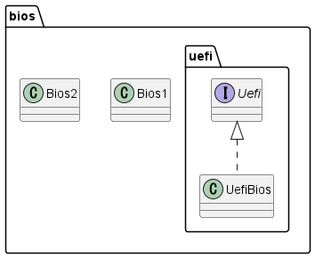

# BIOSとはそしてUEFIとの関係性

## BIOSとは

パソコン工房さんの[こちら](https://www.pc-koubou.jp/magazine/1257)のサイトがわかりやすかったです。

要約すると、BIOSとはPCの起動後に起動されるプログラムで、ハードウェアの初期化や、OSのロードなどを担当するようです。

ハードウェアの制御を行うため、ソフトフェアではなく、ファームウェアと呼ばれます。

## UEFIとは

以下は上記の参考サイトからの引用したものになります。
> BIOSがOSを起動させる場合の仕様について、新しく定義したものをUEFIと呼びます。

つまり、UEFIもBIOSの一種であるということですね。

ややこしいところが、UEFIはインターフェースであり、BIOSはファームウェアであるところではないでしょうか。

この関係性をクラス図にするとこんな感じになると思います。

## 参考

旧BIOSを進化させたUEFI、その基本を解説（前編：役割と概要）  
<https://www.pc-koubou.jp/magazine/1257>
