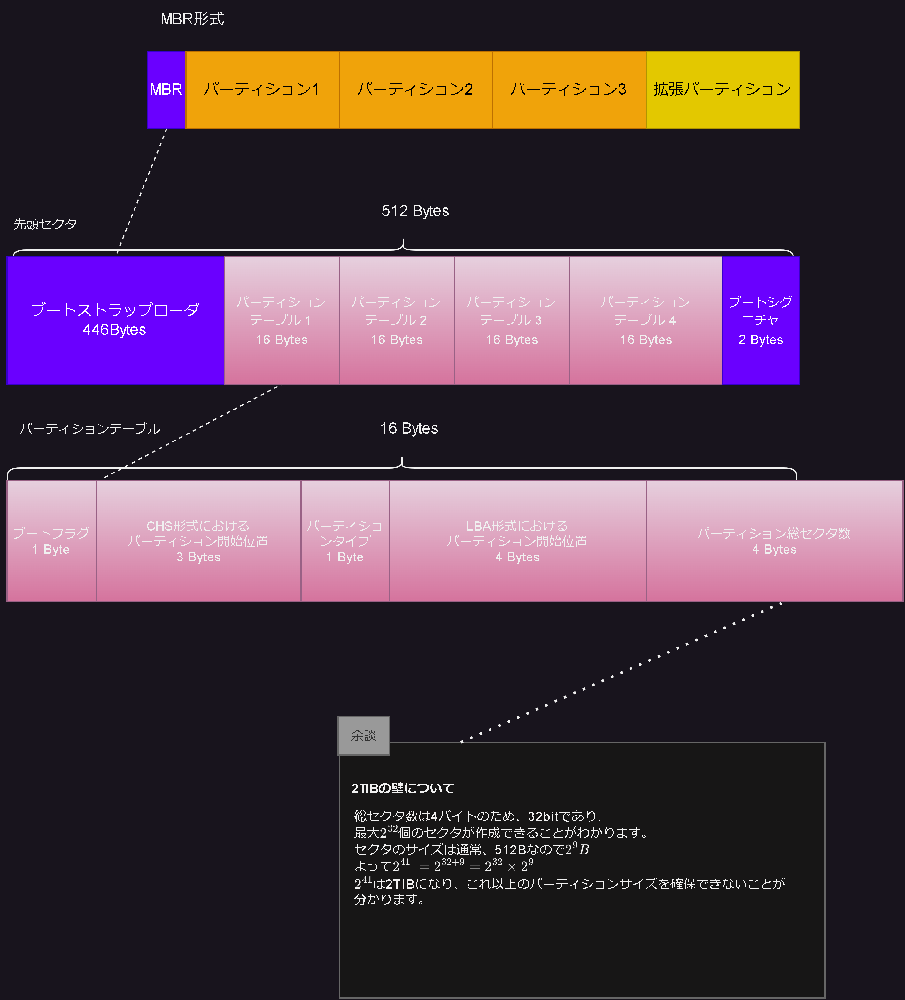

# HDDのパーティションとは

HDDにはMBRとGPT形式の2つがあるようですが、全然知らないかったためそれぞれの形式について調べてみました。

## セクタ

ディスクドライブにおけるデータの最小単位  
通常、512Bytesになるようです。

## MBR

マスターブートレコード
MBRは(Master Boot Record)の略です。

先頭のセクタに起動方法やパーティションの構成を記した情報などが詰め込まれているようです。  
この構成上、パーティションが作成できるのは最大4つまでとなります。  
下記図の先頭セクタを見ていただくと分かりやすいと思います。

## Gpt

MBRと同じように図を書こうかと思っていましたが、下記サイトがわかりやすかったのでURLだけ載せておきます。

<https://www.diskpart.com/jp/gpt-mbr/gpt-guid-partition-table-disk.html>

## 参考

下記のサイトを参考にしました。

マスターブートレコードの解析  
<http://nobusan.jp/computer/boot/mbr.html>

MBR（マスターブートレコード）とは  
<https://jisaku-pc.net/words/mbr.html>

GPT（GUIDパーティションテーブル）ディスクの概念および利点
<https://www.diskpart.com/jp/gpt-mbr/gpt-guid-partition-table-disk.html>
